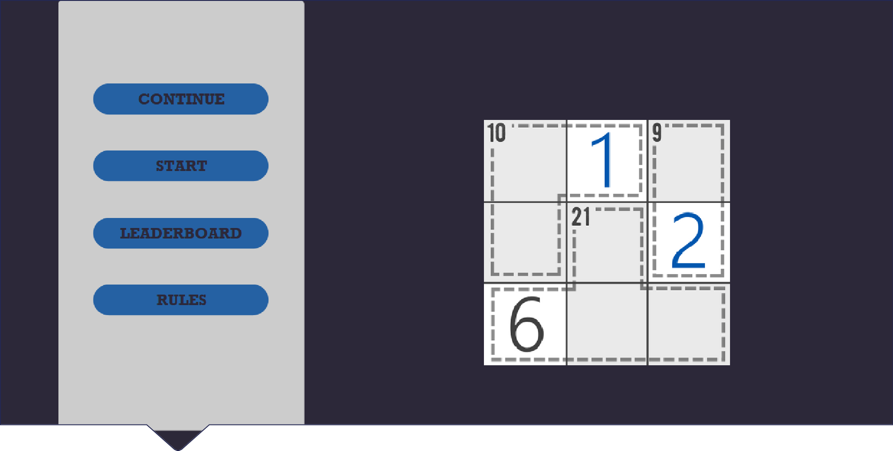
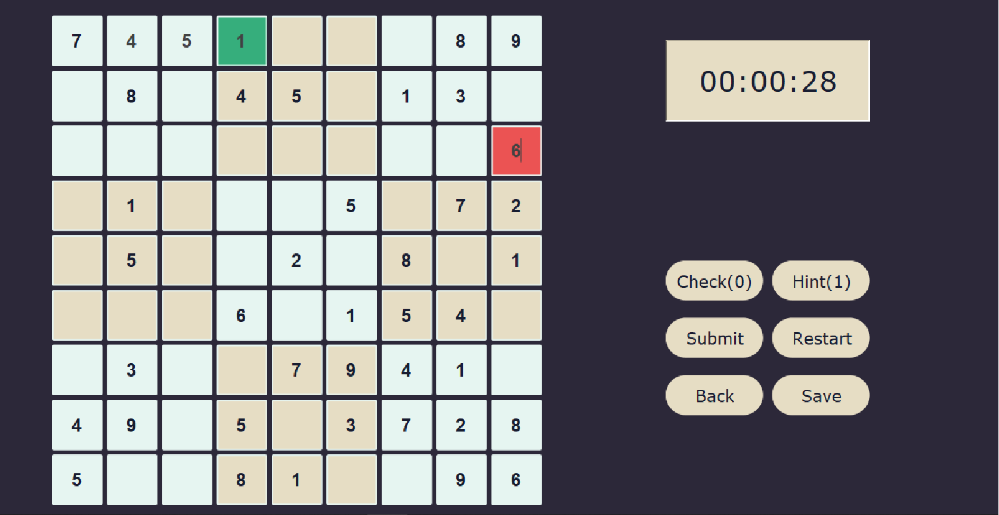
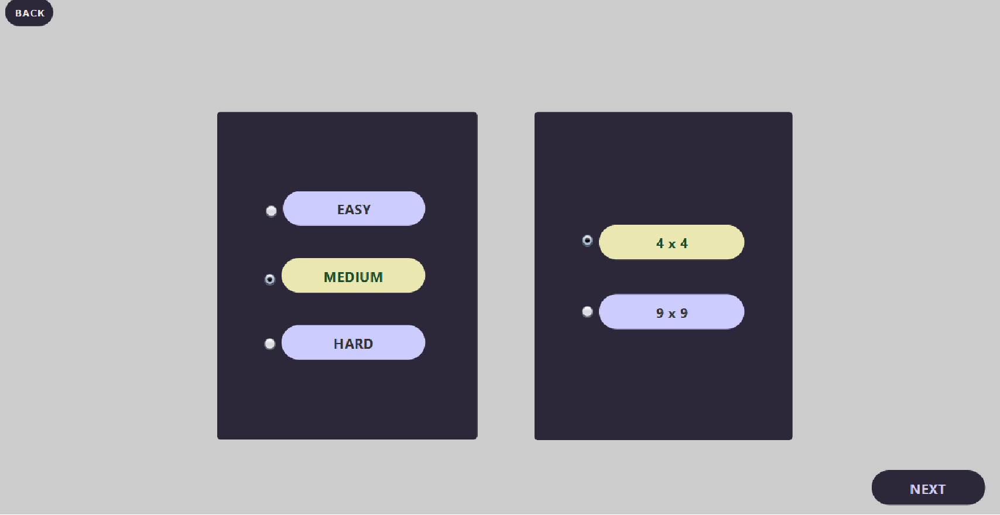
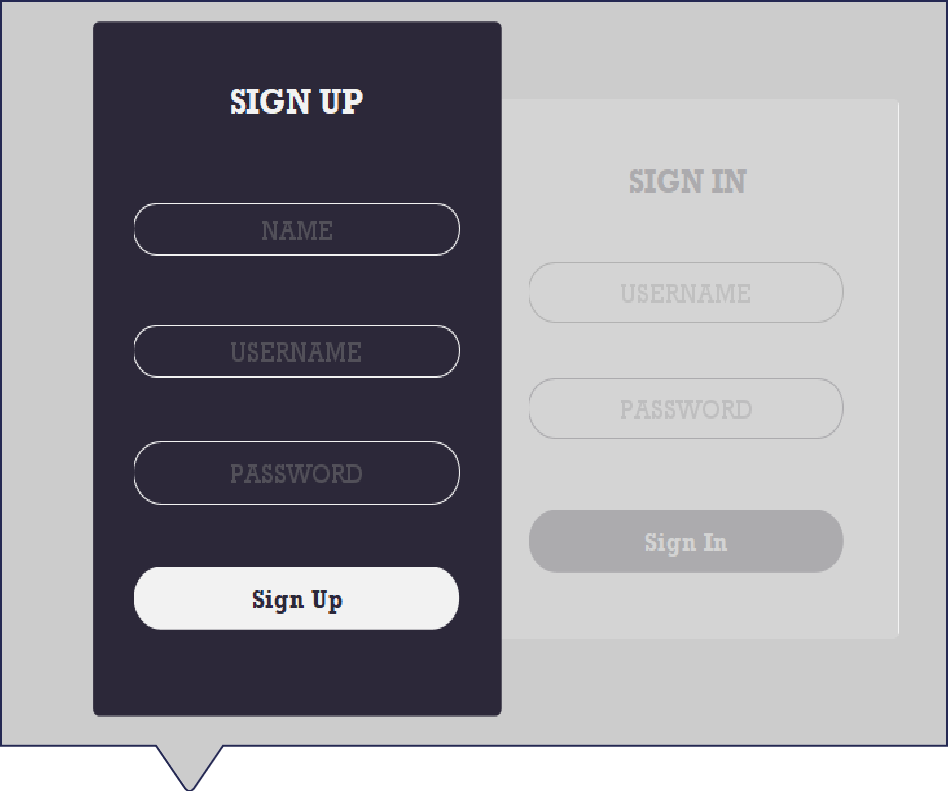
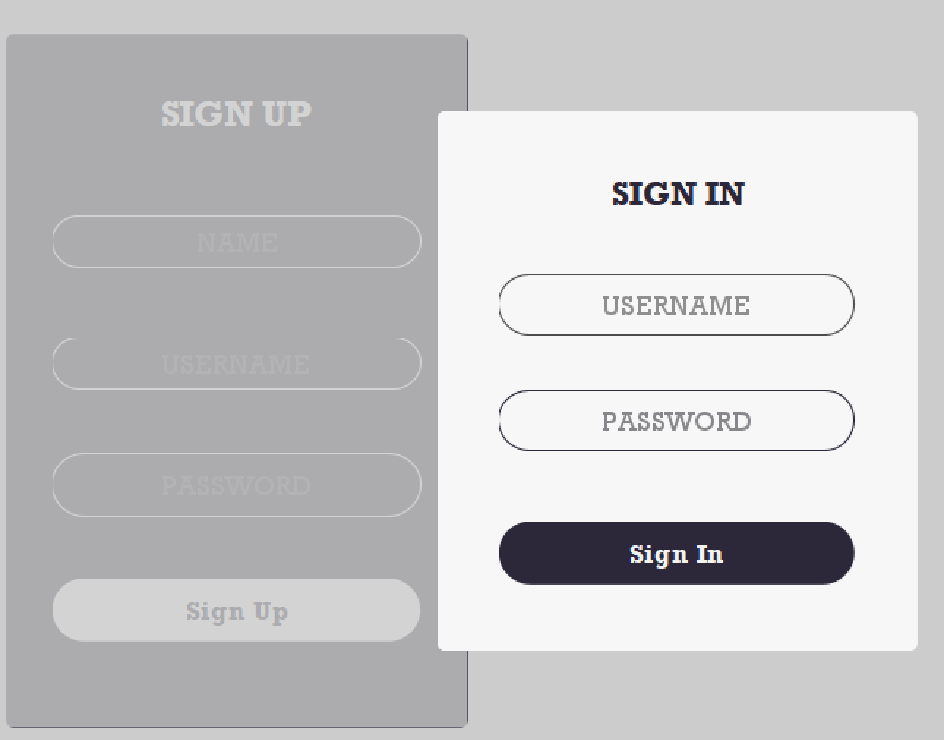
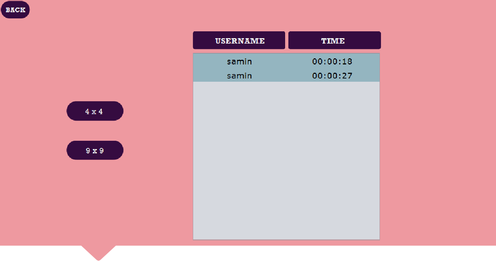

# Sudoku Desktop Application

## Introduction
Sudoku is a logic-based number placement puzzle where the goal is to fill a **9x9 grid** so that each row, column, and **3x3 box** contains the numbers **1 to 9** without repetition. This application provides both **4x4 and 9x9** game modes, each with three difficulty levels.

## Features
- **User Authentication**: Sign up or log in to track progress.
- **Multiple Grid Sizes**: Play **4x4 or 9x9** Sudoku puzzles.
- **Difficulty Levels**: Choose from **Easy, Medium, and Hard**.
- **Game Continuation**: Save unfinished games and resume later.
- **Leaderboard**: Compete with other players.
- **Hints & Validation**: Use hints and check answers before submission.

## How to Play
1. **Sign up or log in** if you're a new user.
2. Choose **New Game** or continue a previous one.
3. Select **grid size** and **difficulty level**.
4. Fill in the grid following Sudoku rules.
5. Use the **Check and Hint** options if needed.
6. Click **Submit** to verify the solution.
7. Save progress to continue later if needed.

## Screenshots
Here are some screenshots of the application:

### Home Screen  

### 9x9 Sudoku Grid  

### Select Difficulty  

### Sign Up & Sign In  
| Sign Up | Sign In |
|---------|--------|
|  |  |

### Leaderboard  

## How Fast Can You Solve a Sudoku?

Give it a try and test your skills!
